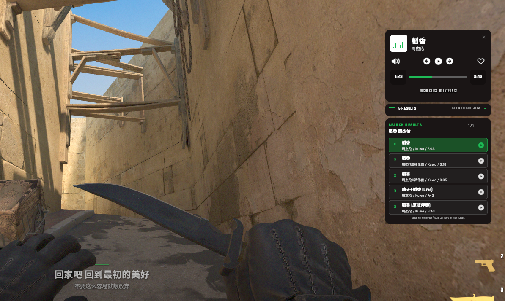

# SwiftOnlineMusicPlayerSW2

[English](README.md) | 简体中文

SwiftOnlineMusicPlayerSW2 是面向 Counter-Strike 2 与 SwiftlyS2 的逐玩家在线音乐播放器。它将在线音频播放、服务器侧歌曲搜索、同步歌词与一套可交互的 `CCSCustomHudLayout` 界面整合在同一个项目中。

## 核心能力

- 每位玩家拥有独立的播放频道、播放进度、音量、搜索结果和歌词状态。
- 支持播放、暂停、继续、停止、上一首、下一首及 0%–100% 六档音量。
- 支持酷我优先、网易云兼容接口回退的服务器侧在线搜索。
- 搜索结果直接显示在 HUD 抽屉中，每页 5 条，最多 10 条，可点击选择。
- 支持酷我 JSON 歌词与网易云 LRC 的逐行同步显示。
- 播放器出现时仍可正常瞄准；按下并松开鼠标右键后进入 UI 交互模式。
- 关闭播放器卡片不会中断音乐；停止播放、切歌、断线或插件卸载会清理相应状态。
- 配置文件支持热重载，并对 URL、DNS、响应大小、超时和音频主机执行服务端校验。
- 歌词机制已直接集成到本项目的 HUD 与 VPK 中，不需要额外安装 HudText 插件或 addon。

## 运行组成与资源分发

本项目运行时由 SwiftlyS2 服务器插件、[SwiftlyS2 Audio](https://github.com/SwiftlyS2-Plugins/Audio) 和客户端 HUD 资源共同组成。

HUD 资源已经发布为 Steam 创意工坊项目：[Online Music Player（3792571203）](https://steamcommunity.com/sharedfiles/filedetails/?id=3792571203)。正式服务器使用 [SwiftlyS2 AddonsManager](https://github.com/SwiftlyS2-Plugins/AddonsManager) 下载、挂载并向玩家分发该 Workshop Addon。

编译、安装、配置、正式服 AddonsManager 接入、本地测试与 GameData 维护统一收录在 [开发者文档](docs/DEVELOPMENT_CN.md) 中。

## 玩家命令

| 命令 | 说明 |
| --- | --- |
| `!music` | 打开或重新打开播放器 |
| `!music_close` | 关闭播放器 UI，音乐继续播放 |
| `!music_stop` | 停止并重置自己的音乐频道 |
| `!music_lyrics [on\|off]` | 显示、隐藏或切换同步歌词 |
| `!music_status` | 查看依赖、HUD、曲库和当前会话状态 |
| `!music_search <歌名或歌手>` | 搜索在线歌曲并展开 HUD 结果 |
| `!music_pick <1-N>` | 播放最近一次搜索中的指定结果 |
| `!music_library` | 退出搜索结果并返回静态曲库 |

## 交互方式

1. 输入 `!music` 后，播放器显示但不会立即捕获鼠标，玩家仍可转动视角。
2. 按下并松开鼠标右键，进入指针交互状态。
3. 点击播放器底部的返回瞄准文字，退出鼠标捕获但保留播放器。
4. 点击右上角 `X`，关闭播放器界面；当前音乐继续播放。

## 文档

- [开发者文档](docs/DEVELOPMENT_CN.md)：架构、构建、配置、部署、GameData 与排错
- [测试指南](TESTING_CN.md)：本地安装、实机测试矩阵与诊断收集
- [MusicSquare 接口分析](docs/MUSICSQUARE_ANALYSIS.md)：搜索适配范围、风险与扩展建议
- [HudText 歌词机制分析](docs/HUDTEXT_LYRICS_ANALYSIS.md)：同步歌词的数据流与生命周期
- [English README](README.md)
- [English development guide](docs/DEVELOPMENT.md)

## 当前状态与限制

- 当前 Custom HUD 原生桥只维护 Windows 签名；Linux GameData 尚未提供。
- 正式服必须通过 AddonsManager 正确下载并挂载 Workshop HUD 资源，否则界面无法显示。
- 在线搜索与歌词依赖第三方接口，项目无法保证其长期可用性。
- 网页链接不是直接音频流。YouTube、Spotify、网易云网页等不能直接作为静态曲目 URL。
- 收藏只在当前连接会话内保存，不会持久化为服务器曲库。
- CS2 更新后必须重新验证 `server.dll` 哈希、GameData 唯一命中与函数 ABI。

## 致谢与第三方项目

- [SwiftlyS2](https://github.com/swiftly-solution/swiftlys2)
- [SwiftlyS2 Audio](https://github.com/SwiftlyS2-Plugins/Audio)
- [HudText](https://github.com/T3Marius/HudText)
- [MusicSquare](https://github.com/CharlesPikachu/musicsquare)
- [Uiverse music player reference](https://uiverse.io/bociKond/serious-robin-34)

本项目借鉴 HudText 的 Custom HUD 更新机制和 MusicSquare 的搜索适配思路，但没有打包它们的插件、addon、访问凭据或第三方音乐内容。第三方项目、接口、音乐目录与素材仍受各自许可证和服务条款约束。

## 许可证

本项目以 [MIT License](LICENSE) 发布。音乐版权、公开播放权以及第三方服务、依赖和素材的授权不包含在该许可证范围内，仍应遵守各自条款。
